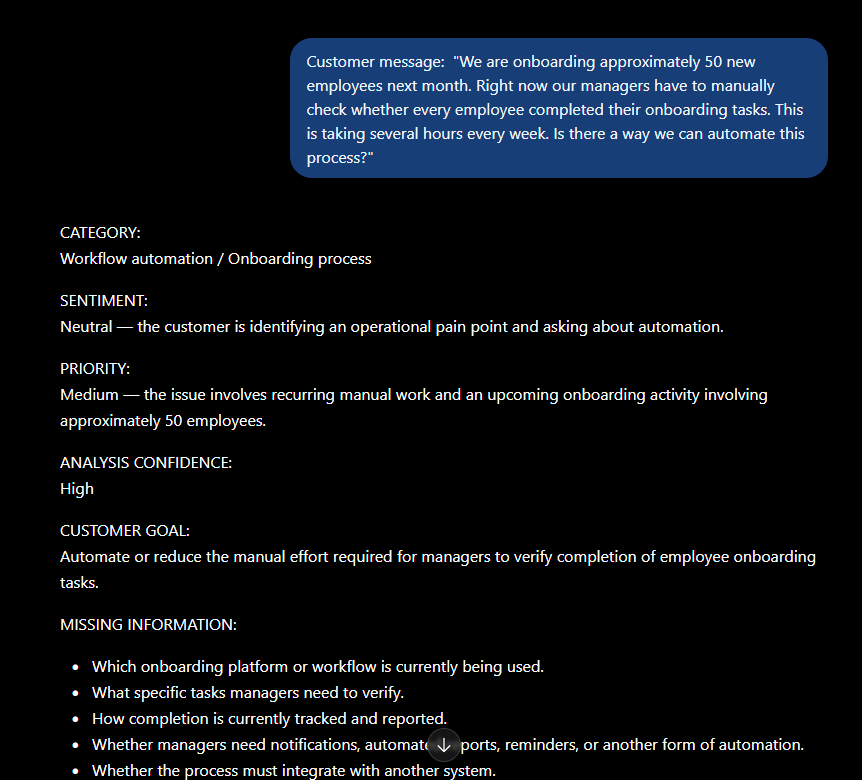
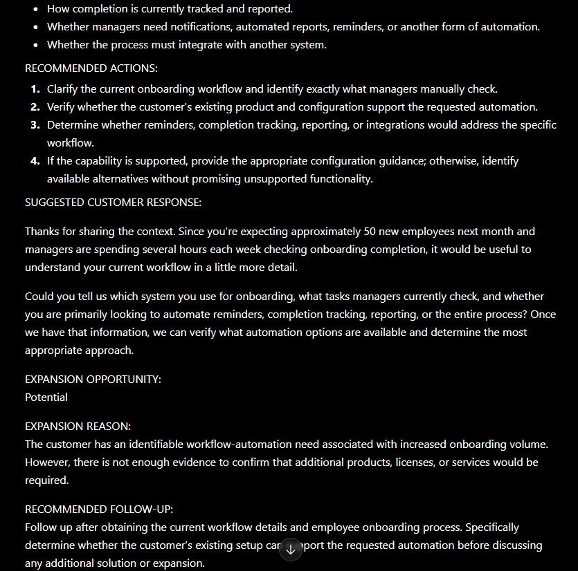

# AI Customer Success Workflow Assistant

## Overview

This project explores how Artificial Intelligence (AI) can support Customer Success workflows by transforming unstructured customer messages into structured, actionable information.

The assistant analyzes a customer message and identifies:

* Category
* Sentiment
* Priority
* Analysis confidence
* Customer goal
* Missing information
* Recommended actions
* Suggested customer response
* Potential expansion opportunity
* Recommended follow-up

The project was created as a practical learning exercise to explore AI-assisted Customer Success workflows, prompt engineering, structured outputs, and AI evaluation.

## Why I Built This

I wanted to explore how Artificial Intelligence (AI) could support a real Customer Success workflow rather than simply generate text.

The idea came from a common Customer Success challenge: customer messages often contain a mixture of technical issues, business impact, requests, missing information, and potential opportunities for broader product adoption.

I built this prototype to test whether AI could provide a consistent first-pass analysis while keeping the Customer Success Manager responsible for the final decision.

The project focuses on experimentation and learning rather than building a production system.

---

## Problem

Customer Success Managers (CSMs) regularly receive customer requests in different formats and with different levels of detail.

A single message might contain:

* A technical problem
* A business impact
* A feature request
* An opportunity to expand product usage
* Missing information that must be collected before taking action

Manually interpreting every message can take time and can lead to inconsistent prioritization or follow-up.

This project explores whether an AI assistant can provide a consistent first-pass analysis while keeping a human Customer Success Manager in the decision-making loop.

---

## How It Works

The workflow follows this general process:

```text
Customer Message
       ↓
AI Analysis
       ↓
Category + Sentiment + Priority
       ↓
Customer Goal
       ↓
Missing Information
       ↓
Recommended Actions
       ↓
Suggested Customer Response
       ↓
Expansion Opportunity
       ↓
Recommended Follow-up
       ↓
Human Customer Success Review
```

The AI does not automatically take action on behalf of the Customer Success Manager.

Instead, it provides structured information that a human can review before responding to the customer or updating internal workflows.

---

## Classification Framework

### Categories

The assistant uses a controlled category taxonomy:

* Technical Issue
* Workflow Automation
* Feature Request
* Integration
* Training / How-To
* Billing
* Account / Access
* General Question

A short secondary descriptor can be added when useful.

### Sentiment

The assistant uses five sentiment categories:

* Positive
* Neutral
* Negative
* Frustrated
* Concerned

Customer intent and sentiment are treated separately. For example, a customer can be positive and exploratory while discussing additional use cases.

### Priority

Priority is determined using the available business impact and urgency information.

| Priority               | Examples                                                                                                       |
| ---------------------- | -------------------------------------------------------------------------------------------------------------- |
| Critical               | Production/service outage, severe business disruption, large numbers of users unable to perform essential work |
| High                   | Important functionality unavailable, significant business impact, time-sensitive issue                         |
| Medium                 | Recurring problem, significant manual work, important workflow issue, upcoming business activity affected      |
| Low                    | General question, training request, feature exploration, minor inconvenience                                   |
| Requires clarification | Not enough information to determine impact, urgency, affected users, or functionality                          |

The **Requires clarification** state is important because the AI should not guess when critical information is missing.

---

## Expansion Opportunity

The assistant does not automatically treat every customer problem as an expansion opportunity.

It uses three levels:

### None

There is no evidence of additional adoption or broader use.

### Potential

The customer mentions needs that could potentially involve:

* Additional workflows
* Additional teams
* More users
* Reporting
* Increased usage
* Additional use cases

### Strong Signal

The customer explicitly expresses interest in:

* Using the platform for another department
* Adding additional workflows
* Expanding the number of users
* Evaluating additional capabilities
* Automating additional business processes

Expansion classification is based on evidence in the customer's message rather than assumptions.

---
### Prompt Design

The core of the project is a structured prompt that instructs the Artificial Intelligence model to:

Analyze the customer's message.
Classify it using predefined categories.
Separate sentiment from customer intent.
Determine priority using defined business-impact rules.
Identify missing information.
Recommend appropriate Customer Success actions.
Generate a customer-facing response.
Identify evidence-based expansion opportunities.
Recommend a follow-up action.
Avoid inventing product capabilities or customer intent.

The prompt also instructs the AI to identify uncertainty instead of making unsupported assumptions.

Testing and Evaluation

The workflow was tested using five different customer scenarios.

Test Case 1 — Workflow Automation

A customer was onboarding approximately 50 employees and manually checking whether onboarding tasks were completed.

Expected behavior:

Identify workflow automation as the primary category.
Recognize recurring manual work.
Classify the issue as Medium priority.
Identify a potential expansion opportunity.
Ask for additional workflow and automation requirements.

Result: Pass

Test Case 2 — Technical Issue

A notification stopped being sent to approximately 30 managers, with another employee group starting the following day.

Expected behavior:

Identify a notification/workflow problem.
Recognize the time-sensitive business impact.
Classify it as High priority.
Recommend technical investigation.
Avoid automatically classifying it as an expansion opportunity.

Result: Pass

Test Case 3 — Feature Request

A customer requested a dashboard showing onboarding completion and outstanding tasks.

Expected behavior:

Classify it as a Feature Request.
Identify the desired business outcome: improved visibility.
Classify the priority as Low because there was no immediate business problem.
Identify a Potential expansion opportunity only if supported by the customer's needs.

Result: Pass after refining the classification taxonomy and separating sentiment from intent.

Test Case 4 — Expansion Signal

A customer already using the platform for employee onboarding expressed interest in using workflows for quarterly compliance reviews and equipment requests.

Expected behavior:

Identify additional use cases.
Recognize a Strong expansion signal.
Recommend discovery before discussing expansion.
Avoid assuming which product capabilities are available.

Result: Pass

Test Case 5 — Ambiguous Request

A customer simply reported:

"Something isn't working correctly with our onboarding process and we need help."

Expected behavior:

Identify that the customer needs assistance.
Request additional information.
Avoid guessing the business impact.
Avoid assigning a definitive priority without sufficient information.

The initial version classified this as Medium priority.

During evaluation, this was identified as an issue because the message did not provide enough information about urgency, affected users, functionality, or business impact.

The priority framework was therefore updated to include:

Requires clarification

The scenario was then considered a successful test of the improved logic.

### What I Learned

This project helped me explore several practical concepts related to Artificial Intelligence and Customer Success.

Prompt Engineering

Small changes to instructions can significantly affect the consistency of AI outputs.

For example, explicitly defining allowed categories reduced inconsistent classifications.

Structured Output

Turning an unstructured customer message into consistent fields makes the information easier to review and potentially easier to integrate into a Customer Relationship Management (CRM) system or workflow automation platform.

Human-in-the-Loop

AI should not necessarily make the final Customer Success decision.

The workflow keeps a human Customer Success Manager involved before customer-facing or operational actions are taken.

AI Evaluation

A single successful example does not demonstrate that an AI workflow is reliable.

Testing multiple scenarios exposed weaknesses that were not obvious from the initial prompt.

Handling Uncertainty

One of the most important lessons was that the AI should sometimes say:

"There is not enough information to determine this."

Rather than forcing a classification, the workflow can request clarification.

Current Limitations

This project is a learning prototype rather than a production Customer Success system.

Current limitations include:

The workflow relies on the quality of the AI model's interpretation.
Product capabilities are not automatically retrieved from verified documentation.
There is no automated Customer Relationship Management (CRM) integration.
There is no persistent customer history.
Human review is still required.
The workflow has been evaluated using a small set of manually created scenarios.
Future Improvements

Possible future iterations include:

Retrieval-Augmented Generation (RAG)

Connect the assistant to verified product documentation so that recommendations can be based on current product capabilities instead of relying only on the model's general knowledge.

Customer Relationship Management Integration

Send structured analysis into a Customer Relationship Management (CRM) system to support customer records, follow-ups, and account management.

Automated Workflow

Connect the analysis to a workflow automation platform so that approved actions can trigger tasks, notifications, or follow-ups.

Evaluation Dataset

Create a larger dataset containing dozens or hundreds of anonymized customer scenarios and evaluate classification consistency.

Human Feedback

Allow Customer Success Managers to correct AI classifications and use those corrections to improve future prompt design.

Project Status

Current status: Learning prototype

The project demonstrates an iterative approach:

Design
  ↓
Test
  ↓
Identify inconsistent behavior
  ↓
Refine instructions
  ↓
Retest
  ↓
Document results

The primary goal is not to create a production-ready AI system, but to demonstrate practical experimentation with AI, Customer Success workflows, structured data, and iterative evaluation.

## Workflow Demonstration

The following example shows the assistant analyzing a customer message and transforming it into structured Customer Success information.




### Author

Xavier

This project was created as part of my exploration of Artificial Intelligence (AI), Customer Success operations, workflow automation, and practical no-code/AI solutions.
